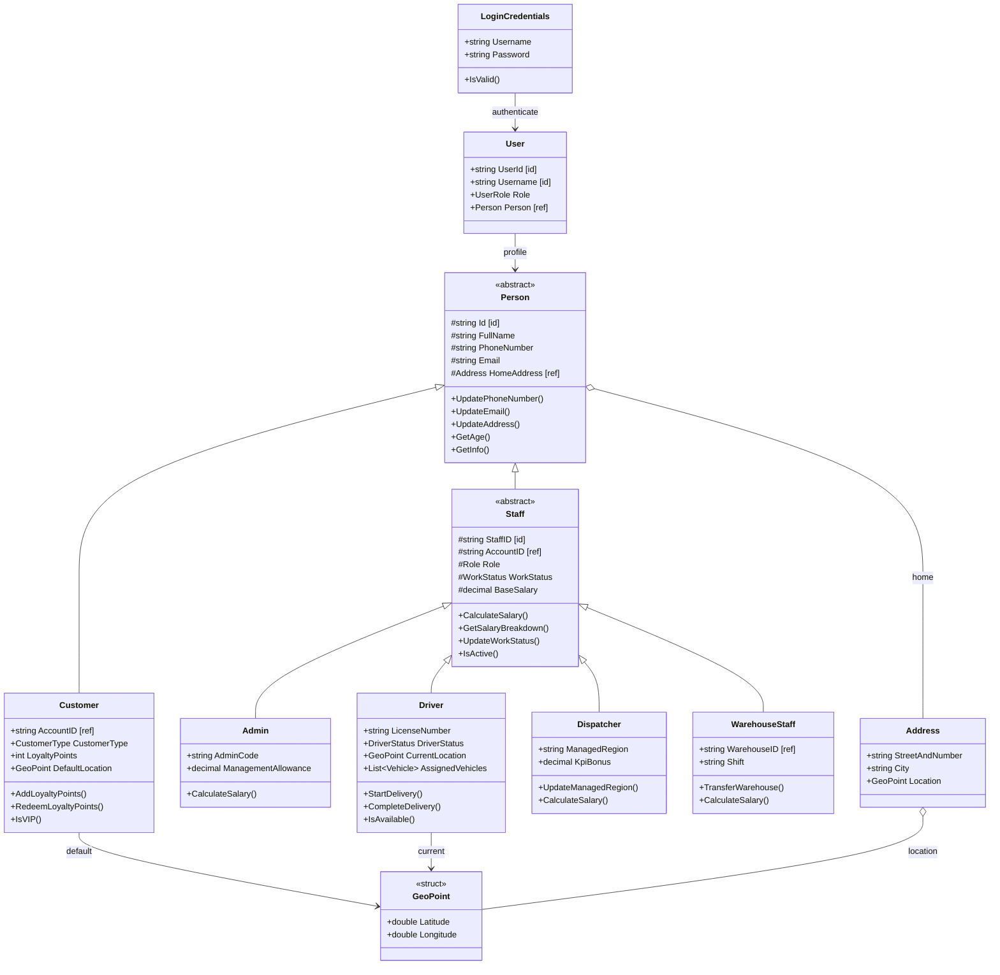
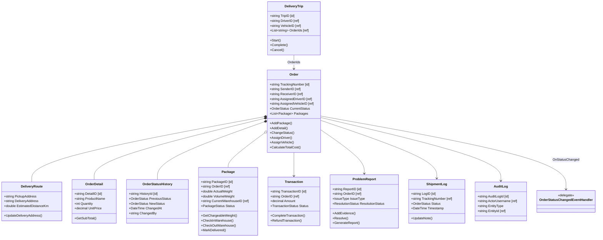
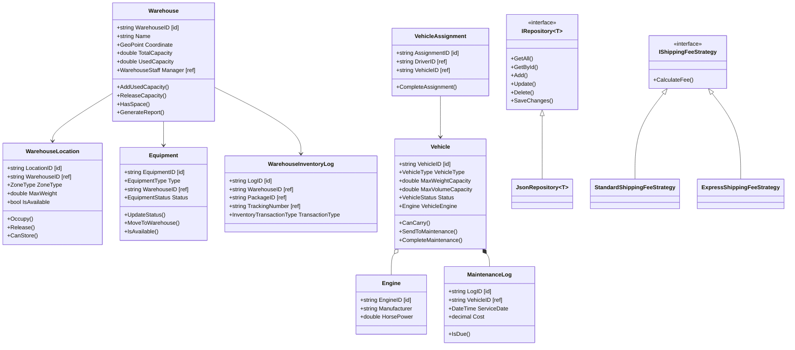

# Chương 2. Phân tích và thiết kế lớp

Tài liệu này mô tả thiết kế lớp của hệ thống Logistics theo đúng mã nguồn hiện tại trong `Logistics.Core`. Nội dung bám theo bố cục chương 2 trong `Tai_lieu.pdf`, nhưng được chuyển sang domain logistics thay vì domain bán hàng siêu thị.

## 1. Phạm vi thiết kế

Hệ thống được chia thành 2 project chính:

| Project | Vai trò |
|---|---|
| `Logistics.Core` | Chứa model nghiệp vụ, service, repository, validation, DTO, mapping, exception, utility và security. |
| `Logistics.WinFormsUI` | Chứa form, user control, helper giao diện, style, tài nguyên và data runtime cho WinForms. |

Sơ đồ lớp chính tập trung vào `Logistics.Core.Models` và các interface/pattern cốt lõi. Các form WinForms không đưa vào class diagram nghiệp vụ để tránh làm sơ đồ quá lớn.

## 2. Count tổng quan

Thống kê dưới đây không tính thư mục `bin` và `obj`.

| Nhóm trong `Logistics.Core` | File `.cs` | Class | Interface | Enum | Delegate |
|---|---:|---:|---:|---:|---:|
| `Configuration` | 1 | 1 | 0 | 0 | 0 |
| `DataAccess` | 18 | 20 | 1 | 0 | 0 |
| `DTOs` | 16 | 17 | 0 | 0 | 0 |
| `Exceptions` | 11 | 11 | 0 | 0 | 0 |
| `Mappings` | 7 | 7 | 0 | 0 | 0 |
| `Models` | 36 | 29 | 3 | 22 | 1 |
| `Security` | 1 | 1 | 0 | 0 | 0 |
| `Services` | 35 | 18 | 17 | 0 | 0 |
| `Utilities` | 8 | 8 | 0 | 0 | 0 |
| `Validations` | 10 | 9 | 1 | 0 | 0 |
| **Tổng** | **143** | **121** | **22** | **22** | **1** |

## 3. Count theo sơ đồ domain chính

| Nhóm domain | Lớp/interface chính | Count |
|---|---|---:|
| Actors | `Person`, `Customer`, `Staff`, `Admin`, `Driver`, `Dispatcher`, `WarehouseStaff` | 7 |
| Account | `User`, `LoginCredentials`, `UserRole` | 3 |
| Business | `Order`, `Package`, `DeliveryRoute`, `DeliveryTrip`, `OrderDetail`, `OrderStatusHistory`, `ShipmentLog`, `Transaction`, `ProblemReport`, `AuditLog` | 10 |
| Infrastructure | `Vehicle`, `Engine`, `Warehouse`, `WarehouseLocation`, `Equipment`, `MaintenanceLog`, `VehicleAssignment`, `WarehouseInventoryLog` | 8 |
| Common | `Address`, `GeoPoint`, `AppConstants`, `Enums` | 4 |
| Model interfaces | `ITrackable`, `IReportable`, `ISalaryCalculable` | 3 |

## 4. Thiết kế lớp

### 4.1. Nhóm tác nhân

`Person` là lớp trừu tượng chứa thông tin chung của con người: mã định danh, họ tên, số điện thoại, email, ngày sinh, giới tính và địa chỉ. `Customer` và `Staff` kế thừa từ `Person`.

`Staff` tiếp tục là lớp trừu tượng cho các vai trò nội bộ. Các lớp con gồm:

| Lớp | Vai trò | Điểm mở rộng |
|---|---|---|
| `Admin` | Quản trị hệ thống | `AdminCode`, `ManagementAllowance`, công thức lương quản lý. |
| `Driver` | Tài xế giao hàng | Bằng lái, trạng thái tài xế, vị trí hiện tại, xe được phân công, thưởng theo chuyến. |
| `Dispatcher` | Điều phối viên | Khu vực quản lý, phụ cấp khu vực, thưởng KPI. |
| `WarehouseStaff` | Nhân viên kho | Mã kho, ca làm việc, phụ cấp ca và phụ cấp nặng nhọc. |

### 4.2. Nhóm đơn hàng và kiện hàng

`Order` là lớp trung tâm của hệ thống. Một đơn hàng quản lý:

- `TrackingNumber`, `SenderID`, `ReceiverID`.
- `DeliveryRoute Route`.
- `List<Package> Packages`.
- `List<OrderDetail> Details`.
- `List<OrderStatusHistory> StatusHistories`.
- `ServiceType`, `OrderStatus`, `CodAmount`, `CodStatus`.
- `AssignedDriverID`, `AssignedVehicleID`.

Các hành vi quan trọng:

- Tạo và xóa kiện hàng.
- Tính tổng khối lượng.
- Tính phí vận chuyển qua `IShippingFeeStrategy`.
- Đổi trạng thái và phát event `OnStatusChanged`.
- Đồng bộ trạng thái kiện hàng theo trạng thái đơn.
- Sinh báo cáo đơn hàng qua `IReportable`.

`Package` quản lý từng kiện hàng:

- Tính `VolumeWeight` từ kích thước.
- Lấy `ChargeableWeight` bằng khối lượng lớn hơn giữa thực tế và quy đổi.
- Kiểm tra hàng dễ vỡ theo `IsFragile`, giá trị hàng và nhóm hàng.
- Theo dõi vị trí kho hiện tại, vị trí kệ và thời điểm scan cuối.

### 4.3. Nhóm kho và phương tiện

`Vehicle` quản lý xe vận chuyển:

- Loại xe, tải trọng, thể tích, kích thước.
- Số km, nhiên liệu, trạng thái.
- Danh sách tài xế được phép vận hành.
- Lịch sử bảo trì.
- Động cơ đang gắn với xe.

`Warehouse` quản lý kho:

- Mã kho, tên kho, địa chỉ, tọa độ.
- Loại kho, tổng sức chứa, sức chứa đã dùng.
- Giờ hoạt động và người quản lý.
- Các hành vi nhập sức chứa, giải phóng sức chứa, kiểm tra còn chỗ và sinh báo cáo.

`WarehouseLocation`, `WarehouseInventoryLog`, `Equipment`, `MaintenanceLog` và `VehicleAssignment` bổ sung quản lý vị trí kệ, nhật ký nhập/xuất, thiết bị, bảo trì và phân công xe.

### 4.4. Nhóm tài khoản và bảo mật

`User` lưu tài khoản đăng nhập, mật khẩu băm, salt, vai trò, câu hỏi bảo mật, trạng thái hoạt động và đối tượng `Person` liên kết. `SessionManager` giữ phiên đăng nhập hiện tại, còn `RoleGuard` gom các kiểm tra quyền:

- `CanDispatch()`
- `CanManageStaff()`
- `CanManageWarehouse()`
- `CanManageVehicles()`
- `CanViewReports()`

## 5. Sơ đồ lớp tổng quát

### 5.1. Quy ước trình bày

Sơ đồ lớp trong báo cáo được trình bày theo UML class diagram, không phải ERD. Vì hệ thống lưu dữ liệu bằng JSON thay vì cơ sở dữ liệu quan hệ, các trường định danh như `TrackingNumber`, `VehicleID`, `WarehouseID` không phải khóa chính SQL. Tài liệu dùng quy ước:

- `[id]`: trường định danh nghiệp vụ của model, tương đương khóa chính ở mức domain.
- `[ref]`: trường tham chiếu tới định danh của model khác, tương đương khóa ngoại ở mức domain.
- `+`: public.
- `#`: protected.
- Chỉ liệt kê field/method nghiệp vụ tiêu biểu để sơ đồ vẫn đọc được; chi tiết đầy đủ nằm trong mã nguồn.
- Không vẽ dependency bằng nét đứt trong sơ đồ chính; các tham chiếu kiểu khóa ngoại được trình bày bằng `[ref]` và bảng bên dưới để tránh rối hình.

| Lớp | Trường `[id]` | Trường `[ref]` chính |
|---|---|---|
| `Person` | `Id` | `HomeAddress` |
| `User` | `UserId`, `Username` | `Person` |
| `Staff` | `StaffID` | `AccountID` |
| `Order` | `TrackingNumber` | `SenderID`, `ReceiverID`, `AssignedDriverID`, `AssignedVehicleID` |
| `Package` | `PackageID` | `OrderID`, `CurrentWarehouseID` |
| `DeliveryTrip` | `TripID` | `DriverID`, `VehicleID`, `OrderIds` |
| `Transaction` | `TransactionID` | `OrderID` |
| `ProblemReport` | `ReportID` | `OrderID` |
| `ShipmentLog` | `LogID` | `TrackingNumber` |
| `AuditLog` | `AuditLogId` | `ActorUsername`, `EntityType`, `EntityId` |
| `Vehicle` | `VehicleID` | `AllowedDrivers`, `MaintenanceHistory`, `VehicleEngine` |
| `Warehouse` | `WarehouseID` | `Manager` |
| `WarehouseLocation` | `LocationID` | `WarehouseID` |
| `WarehouseInventoryLog` | `LogID` | `WarehouseID`, `PackageID`, `TrackingNumber` |
| `Equipment` | `EquipmentID` | `WarehouseID` |
| `VehicleAssignment` | `AssignmentID` | `DriverID`, `VehicleID` |

### 5.2. Sơ đồ quan hệ tổng quan

```mermaid
classDiagram
direction TB

class Person {
  <<abstract>>
  +string Id
  +string FullName
  +string PhoneNumber
  +string Email
  +DateTime BirthDay
  +Address HomeAddress
  +GetAge()
  +GetInfo()
}

class Customer {
  +string AccountID
  +CustomerType CustomerType
  +int LoyaltyPoints
  +GeoPoint DefaultLocation
  +AddLoyaltyPoints()
  +IsVIP()
}

class Staff {
  <<abstract>>
  +string StaffID
  +Role Role
  +WorkStatus WorkStatus
  +decimal BaseSalary
  +CalculateSalary()
  +GetSalaryBreakdown()
}

class Admin
class Driver {
  +string LicenseNumber
  +DriverStatus DriverStatus
  +GeoPoint CurrentLocation
  +List~Vehicle~ AssignedVehicles
  +StartDelivery()
  +CompleteDelivery()
}
class Dispatcher
class WarehouseStaff

Person <|-- Customer
Person <|-- Staff
Staff <|-- Admin
Staff <|-- Driver
Staff <|-- Dispatcher
Staff <|-- WarehouseStaff

class Order {
  +string TrackingNumber
  +string SenderID
  +string ReceiverID
  +DeliveryRoute Route
  +List~OrderDetail~ Details
  +List~OrderStatusHistory~ StatusHistories
  +List~Package~ Packages
  +OrderStatus CurrentStatus
  +OrderStatusChangedEventHandler OnStatusChanged
  +AddPackage()
  +ChangeStatus()
  +CalculateTotalCost()
}

class Package {
  +string PackageID
  +string OrderID
  +double ActualWeight
  +double VolumeWeight
  +PackageStatus Status
  +GetChargeableWeight()
  +CheckInWarehouse()
  +MarkDelivered()
}

class DeliveryRoute
class OrderDetail
class OrderStatusHistory
class DeliveryTrip
class Transaction
class ProblemReport
class ShipmentLog
class AuditLog
class OrderStatusChangedEventHandler {
  <<delegate>>
}

Customer "1" --> "0..*" Order : sender/receiver
Order "1" *-- "1" DeliveryRoute : owns
Order "1" *-- "0..*" OrderDetail : details
Order "1" *-- "0..*" OrderStatusHistory : history
Order "1" o-- "0..*" Package : packages
Order "1" --> "0..*" Transaction
Order "1" --> "0..*" ProblemReport
Order "1" --> "0..*" ShipmentLog
Order "1" --> "0..*" AuditLog : audited by
Order --> OrderStatusChangedEventHandler : OnStatusChanged
DeliveryTrip "1" --> "1..*" Order : order ids

class User {
  +string UserId
  +string Username
  +string PasswordHash
  +UserRole Role
  +Person Person
  +bool IsActive
}
class LoginCredentials {
  +string Username
  +string Password
  +IsValid()
}
class UserRole {
  <<enum>>
}
class Address {
  +string StreetAndNumber
  +string Ward
  +string District
  +string City
  +GeoPoint Location
}
class GeoPoint {
  <<struct>>
  +double Latitude
  +double Longitude
}

User "1" --> "0..1" Person : linked profile
User --> UserRole : role
LoginCredentials --> User : authenticate
AuditLog --> User : actor username
Person "1" o-- "1" Address : home address
Address "1" o-- "0..1" GeoPoint : location
Customer --> GeoPoint : default location
Driver --> GeoPoint : current location

class Vehicle {
  +string VehicleID
  +VehicleType VehicleType
  +double MaxWeightCapacity
  +double MaxVolumeCapacity
  +VehicleStatus Status
  +CanCarry()
  +SendToMaintenance()
}

class Engine
class MaintenanceLog
class VehicleAssignment

Vehicle "1" o-- "1" Engine : installed engine
Vehicle "1" *-- "0..*" MaintenanceLog
Driver "1" --> "0..*" Vehicle : assigned
VehicleAssignment --> Driver
VehicleAssignment --> Vehicle

class Warehouse {
  +string WarehouseID
  +double TotalCapacity
  +double UsedCapacity
  +WarehouseStaff Manager
  +AddUsedCapacity()
  +ReleaseCapacity()
  +GenerateReport()
}

class WarehouseLocation
class Equipment
class WarehouseInventoryLog

Warehouse "1" --> "0..*" WarehouseLocation
Warehouse "1" --> "0..*" Equipment
Warehouse "1" --> "0..*" WarehouseInventoryLog
Warehouse "1" --> "0..1" WarehouseStaff : manager
Package "0..*" --> "0..1" Warehouse : current location
Warehouse --> GeoPoint : coordinate

class ITrackable {
  <<interface>>
  +GetCurrentStatus()
  +GetTrackingInfo()
}
class IReportable {
  <<interface>>
  +GenerateReport()
}
class ISalaryCalculable {
  <<interface>>
  +CalculateSalary()
  +GetSalaryBreakdown()
}

ITrackable <|-- Driver
ITrackable <|-- Order
ITrackable <|-- Vehicle
ITrackable <|-- Warehouse
ITrackable <|-- WarehouseLocation
ITrackable <|-- Equipment
IReportable <|-- Order
IReportable <|-- Warehouse
IReportable <|-- ProblemReport
ISalaryCalculable <|-- Staff

class IRepository~T~ {
  <<interface>>
  +GetAll()
  +GetById()
  +Add()
  +Update()
  +Delete()
  +SaveChanges()
}

class JsonRepository~T~
IRepository~T~ <|-- JsonRepository~T~

class IShippingFeeStrategy {
  <<interface>>
  +CalculateFee()
}
class StandardShippingFeeStrategy
class ExpressShippingFeeStrategy
IShippingFeeStrategy <|-- StandardShippingFeeStrategy
IShippingFeeStrategy <|-- ExpressShippingFeeStrategy
Order --> IShippingFeeStrategy : calculate fee
```



### 5.3. Sơ đồ chi tiết theo cụm

#### 5.3.1. Nhóm tác nhân và tài khoản



#### 5.3.2. Nhóm đơn hàng và nghiệp vụ vận chuyển



#### 5.3.3. Nhóm kho, phương tiện và pattern



## 6. Count quan hệ chính trong sơ đồ

| Loại quan hệ | Count chính | Ví dụ |
|---|---:|---|
| Inheritance | 6 | `Customer -> Person`, `Staff -> Person`, `Driver/Admin/Dispatcher/WarehouseStaff -> Staff`. |
| Interface realization trong domain | 10+ | `Order -> ITrackable`, `Warehouse -> IReportable`, `Staff -> ISalaryCalculable`. |
| Composition | 4 nhóm | `Order -> DeliveryRoute`, `Order -> OrderDetail`, `Order -> OrderStatusHistory`, `Vehicle -> MaintenanceLog`. |
| Aggregation | 3 nhóm | `Order -> Package`, `Vehicle -> Engine`, `Driver -> Vehicle`. |
| Association | 12+ | `Order -> Customer`, `Order -> Driver`, `Order -> Vehicle`, `Warehouse -> WarehouseStaff`, `Transaction -> Order`, `User -> Person`. |
| Dependency | 7+ | Không vẽ bằng nét đứt trong sơ đồ để tránh rối; đọc qua `[ref]` và phần phân tích như `Order -> IShippingFeeStrategy`, `AuditLog -> User`, `Service -> Repository`. |

## 7. Các tính chất OOP được áp dụng

### 7.1. Encapsulation

Các thuộc tính quan trọng thường dùng `private set` hoặc `protected set`. Ví dụ `Package.Status`, `Vehicle.Status`, `Order.CurrentStatus`, `Staff.BaseSalary` không được sửa trực tiếp từ ngoài lớp. Muốn thay đổi phải gọi phương thức nghiệp vụ như:

- `Order.ChangeStatus()`
- `Package.CheckInWarehouse()`
- `Package.MarkDelivered()`
- `Vehicle.UpdateStatus()`
- `Vehicle.SendToMaintenance()`
- `Staff.UpdateBaseSalary()`

### 7.2. Abstraction

Các lớp và interface trừu tượng:

- `Person`: abstract base class cho người dùng.
- `Staff`: abstract base class cho nhân sự.
- `ITrackable`: chuẩn hóa hành vi theo dõi trạng thái.
- `IReportable`: chuẩn hóa hành vi tạo báo cáo.
- `ISalaryCalculable`: chuẩn hóa hành vi tính lương.
- `IRepository<T>`: chuẩn hóa truy cập dữ liệu.
- `IShippingFeeStrategy`: chuẩn hóa thuật toán tính phí.

### 7.3. Inheritance

Hệ thống dùng kế thừa để mô hình hóa phân cấp tác nhân:

```text
Person
├── Customer
└── Staff
    ├── Admin
    ├── Driver
    ├── Dispatcher
    └── WarehouseStaff
```

### 7.4. Polymorphism

Đa hình thể hiện rõ qua:

- `Staff.CalculateSalary()` được override bởi `Admin`, `Driver`, `Dispatcher`, `WarehouseStaff`.
- `IShippingFeeStrategy.CalculateFee()` có nhiều cách tính trong `StandardShippingFeeStrategy` và `ExpressShippingFeeStrategy`.
- `ITrackable.GetTrackingInfo()` trả về thông tin khác nhau tùy đối tượng: đơn hàng, xe, kho, tài xế, vị trí kho, thiết bị.

## 8. Design Pattern

| Pattern | Vị trí | Mục đích |
|---|---|---|
| Repository Pattern | `IRepository<T>`, `JsonRepository<T>`, các repository cụ thể | Tách truy cập dữ liệu khỏi service và UI. |
| Strategy Pattern | `IShippingFeeStrategy`, `StandardShippingFeeStrategy`, `ExpressShippingFeeStrategy` | Cho phép thay đổi thuật toán tính phí vận chuyển linh hoạt. |
| Factory Method | `RepositoryFactory.CreateRepository<T>()` | Gom logic tạo repository JSON vào một điểm. |
| Observer Pattern | `Order.OnStatusChanged`, `NotificationService.OnNotificationReceived` | Phát sự kiện khi trạng thái/thông báo thay đổi. |
| Session/Singleton-like Manager | `SessionManager` | Duy trì phiên đăng nhập hiện hành trong toàn ứng dụng. |
| DTO + Mapper | `DTOs`, `Mappings/*Extensions.cs` | Tách model nghiệp vụ khỏi dữ liệu hiển thị ở UI. |

## 9. Serialization và Deserialization

Hệ thống lưu dữ liệu bằng JSON qua Newtonsoft.Json. Các điểm chính:

- Model quan trọng như `Person`, `Order`, `Vehicle`, `Warehouse` hỗ trợ `ISerializable`.
- Nhiều thuộc tính dùng `[JsonProperty]` để Newtonsoft.Json có thể serialize/deserialize dù setter không public.
- Các class có constructor không tham số để phục vụ JSON deserialization.
- `JsonRepository<T>` dùng generic để tái sử dụng đọc/ghi cho nhiều kiểu model.
- `JsonRepository<T>` dùng `_fileLock` để tránh ghi đồng thời.
- Khi lưu, repository ghi ra `.tmp`, backup file cũ thành `.bak`, rồi thay thế file chính.
- Khi đọc file lỗi, repository thử khôi phục từ `.bak`; nếu không được thì bảo toàn file lỗi bằng `.corrupt`.
- `LogisticsSerializationBinder` giới hạn kiểu được deserialize khi dùng `TypeNameHandling.Auto`, giảm rủi ro bảo mật.

## 10. Kết luận thiết kế lớp

Thiết kế lớp của hệ thống Logistics thể hiện đầy đủ các đặc trưng quan trọng của lập trình hướng đối tượng:

- Có phân cấp kế thừa rõ ràng ở nhóm người dùng và nhân sự.
- Có interface để trừu tượng hóa hành vi theo dõi, báo cáo, tính lương, lưu trữ và tính phí.
- Có đóng gói trạng thái qua `private set` và phương thức nghiệp vụ.
- Có đa hình qua tính lương, tính phí vận chuyển và tracking.
- Có các quan hệ OOP gồm inheritance, realization, association, aggregation, composition và dependency.
- Có áp dụng design pattern thực tế: Repository, Strategy, Factory Method, Observer, Session Manager, DTO/Mapper.
- Có cơ chế serialization/deserialization đủ an toàn cho đồ án OOP dùng file JSON.
